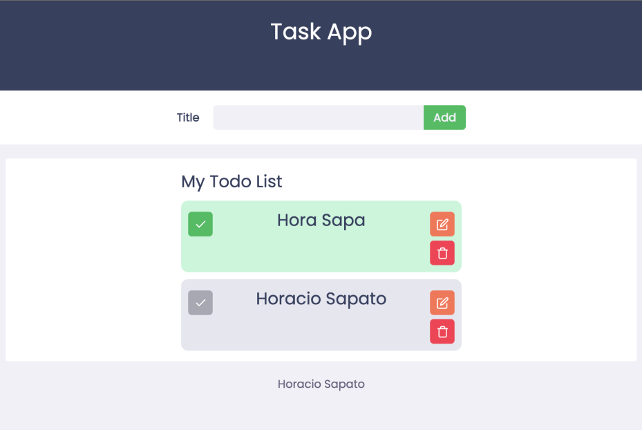
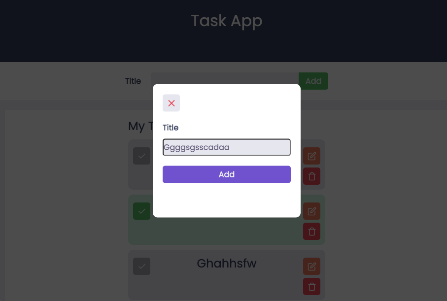

# Todo App with saga

<br>
<p align="center">
  

</p> 
<br>

<p align="center">
  <a href="#-about">About</a>&nbsp;&nbsp;&nbsp;|&nbsp;&nbsp;&nbsp;
  <a href="#-layout">Layout</a>&nbsp;&nbsp;&nbsp;|&nbsp;&nbsp;&nbsp;
  <a href="#-projeto">Languages</a>&nbsp;&nbsp;&nbsp;|&nbsp;&nbsp;&nbsp;
  <a href="#-usage">Usage</a>&nbsp;&nbsp;&nbsp;|&nbsp;&nbsp;&nbsp;
  <a href="#-technologies">Technologies</a>&nbsp;&nbsp;&nbsp;|&nbsp;&nbsp;&nbsp;
  <a href="#memo-licence">Licence</a>&nbsp;&nbsp;&nbsp;|&nbsp;&nbsp;&nbsp;
</p>

#### About

The main propose of this project is to create a Todo app where we could add new todos, delete, update and change the status our todos as done or uncheck, by saving the tasks in local storage.

##  Languages

- JavaScript
- Typescript
## Usage

```sh
git clone https://github.com/HoracioSA/Todo-with-redux-saga.git

cd Todo-with-redux-saga
yarn install
yarn start

```
#### Technologies

|    Lib       | Version  |
| ------------ | -------- |
| redux saga   | 2.2.9    |
| redux        | 4.1.1    |
| redux-thunk  | 2.3.0    |
| clsx         | 0.32.9   |
| formik       | 2.29     |
| -------------|--------- |

## :bookmark: License

This project is [MIT](LICENSE) licensed.